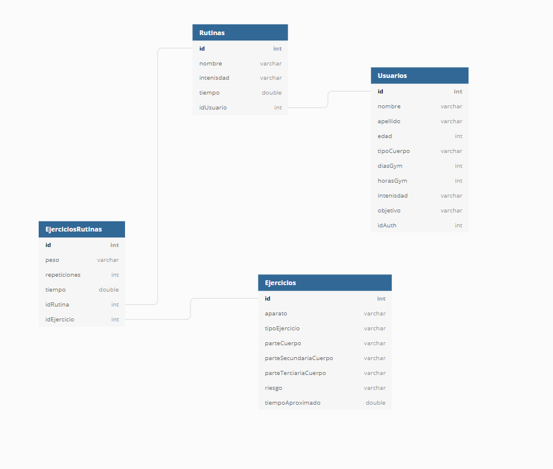

# MyGym
Proyecto Laboratorio web

## Como correr el proyecto


### Frontend

Corriendo con angular en puerto [4200](http://localhost:4200/)

```
ng serve --open
```

### Backend

Corriendo con express en el puerto [8080](http://localhost:8080/)
Entrar a la carpeta api y correr:

```
node server.js
```

Base de datos




ORM

[sequelize](https://sequelize.org/master/)

[tutorial](https://www.youtube.com/watch?v=Crk_5Xy8GMA&ab_channel=PedroTech)